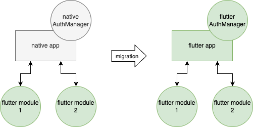

# synced_bloc plugin

A [bloc](https://pub.dev/packages/bloc) that is synced across platform channels.

## Overview

Transform any bloc into a sync master and access it anywhere within the app where platform channels are accessible. You can for example share a bloc between different flutter instances and even access it in native code. This works by transforming states and events to json and sending it over platform channels.

## Motivation

So far I've discovered two scenarios where this package is of great help:
- Add-to-app scenario
  - Maintain app dependencies in dart and share them with any flutter instances and native code.
  - See [example/add_to_android_app](https://github.com/mase7569/synced_bloc/tree/master/example/add_to_android_app)
- Hosting native views
  - Maintain the view's state in dart and share it with native code. No need for pigeon setup or any native state management.
  - See [example/host_native_android_view](https://github.com/mase7569/synced_bloc/tree/master/example/host_native_android_view)

## Usage

### Transform any bloc into a sync master

1) Use `with SyncMasterMixin`
2) First call in constructor: `setupSyncMaster(...)`

Example:
```dart
class AuthBloc extends Bloc<AuthEvent, AuthState> with SyncMasterMixin {
  AuthBloc() : super(const _LoggedOut()) {
    setupSyncMaster(
        masterId: 'auth', // masterId must be unique within app
        stateToJson: (state) => state.toJson(), // automatically generated if using freezed: https://pub.dev/packages/freezed#fromjsontojson
        eventFromJson: (json) => AuthEvent.fromJson(json), // same
      );
    on<_LogIn>(_onLogIn);
    on<_LogOut>(_onLogOut);
  }

  //...

}
```

Create the bloc object as usual:
```dart
AuthBloc authBloc = AuthBloc();
```

### Access the bloc in dart (e.g in another flutter instance)

1) Use `extends Bloc<...> with SyncSubscriberMixin implements TheBloc`
2) First call in constructor `setupSyncSubscriber(...)`

Example:
```dart
class AuthBlocSubscriber extends Bloc<AuthEvent, AuthState>
    with SyncSubscriberMixin
    implements AuthBloc {

  AuthBlocSubscriber({required String id, AuthState? initialState})
      : super(initialState ?? const AuthState.loggedOut()) {
    setupSyncSubscriber(
        masterId: 'auth', // auth is the masterId
        subscriberId: id, // (masterId, subscriberId) must to be unique within app
        stateFromJson: (json) => AuthState.fromJson(json), // automatically generated if using freezed: https://pub.dev/packages/freezed#fromjsontojson
        eventToJson: (event) => event.toJson(), // same
      );
  }

  // optional, see below
  static Future<AuthBlocSubscriber> create({required String id}) async {
    AuthState masterState = await SyncSubscriberMixin.getMasterState(
        masterId: 'auth', fromJson: (json) => AuthState.fromJson(json));
    return AuthBlocSubscriber(id: id, initialState: masterState);
  }
}

```

Create the SyncSubscriber (note: the type is AuthBloc, just as master's):
```dart
AuthBloc authBloc = AuthBlocSubscriber(id: 'whatever');
```

The subscriber's state will automatically transition to master's state in just a few milliseconds. If this is undesirable, consider:
```dart
AuthBloc authBloc = await AuthBlocSubscriber.create(id: 'whatever');
```

Note:
- Each master can have any number of subscribers.
- Use a different library (i.e dart-file) than sync master's library for the subscriber - otherwise you'll see a compile time error.

### Access the bloc in native code

Simply:

```kotlin
NativeSyncSubscriber.withMasterId("auth") //'auth' is the masterId
```

You might wanna refine this "bloc" a bit since its state and events are all json. You could e.g create a new native bloc object which handles converting json-to-native for the state and native-to-json for events. It's usually easy to convert between json and native objects, just use a tool such as https://jsonformatter.org/json-to-kotlin.

[An example of this here](https://github.com/mase7569/synced_bloc/blob/master/example/host_native_android_view/android/app/src/main/kotlin/dev/masel/host_native_android_view/CompassBloc.kt)

## Add-to-app scenario

- [Add-to-app official docs](https://docs.flutter.dev/development/add-to-app)
- [Using multiple instances is convenient and officially recommended](https://docs.flutter.dev/development/add-to-app/multiple-flutters)
- [As mentioned here, communication between instances is handled using platform channels](https://docs.flutter.dev/development/add-to-app/multiple-flutters#communication).

So, how can this package help here? Again, **let's take auth handling as an example**.

### Conventional, slightly problematic approach

So, you start of with native implementations of your app. At this point, there is auth state handling implemented natively. Now you want to add flutter modules which depend on auth state. One way is to make the module depend on platform channel interfaces to get the auth state from native platform using communication over platform channel with e.g [pigeon](https://pub.dev/packages/pigeon).



Some problems and limitations with this approach though:
- Need to setup the communication in dart and native code (Pigeon will help but still some work) (**left diagram**).
- Once it's time to move the modules into a flutter platform (**right diagram**), it's not perfectly trivial to do so as the modules depend on platform channel based interfaces, and now instead need to communicate with the flutter platform.
- Accessing the state will always be async, as platform channels are async (**left diagram**).
- Non-trivial to listen to auth changes in the module (**left diagram**), (as you might have other modules which also want to listen to auth changes, and platform channels can only have one handler so sending messages over a platform channel from native to dart can only be intercepted by one module).
- You might end up updating and maintaining multiple versions of same entity during the migration (any native versions of the AuthManager as well as the flutter version).

### Simplified approach using SyncedBloc

With this package, the whole process can be simplified. Instead of above method, start by creating a sync master AuthManager (AuthBloc) in dart and let any flutter modules and native views depend on this AuthManager instead of any native AuthManager. Now, actually all limitations with previous method mentioned above are eliminated.


On native app startup, create (and cache) any flutter modules you have - including a **dependency maintainer** module. The dependency maintainer doesn't have any ui, it only creates and maintains dependency objects (sync master blocs!). It's running during the whole app lifecycle and provides dependencies to other modules/ native app. Anyone can access these dependencies by creating a sync subscriber.

Any native view (i.e not yet migrated to flutter) that needs to access/modify the auth state may make use of the dependency maintainer's AuthManager instead of the old native implementation, so the auth state is correctly updated etc (or just make the native AuthManager depend on the flutter AuthManager as illustrated in the diagram with the dashed arrow).

Please see [example/add_to_android_app](https://github.com/mase7569/synced_bloc/tree/master/example/add_to_android_app) for more details.

## FAQ

### Can I sync blocs between isolates

No, unfortunately flutter doesn't currently support setting up method call handlers in other isolates than the main isolate. Checkout https://pub.dev/packages/isolate_bloc instead.
